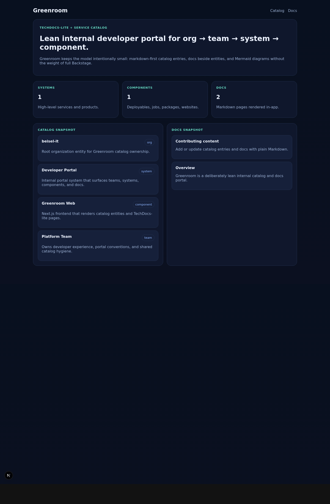
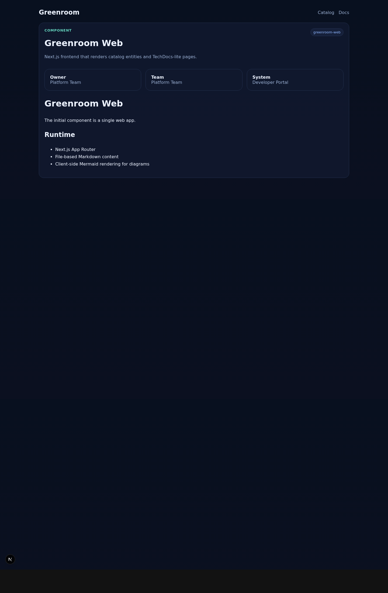
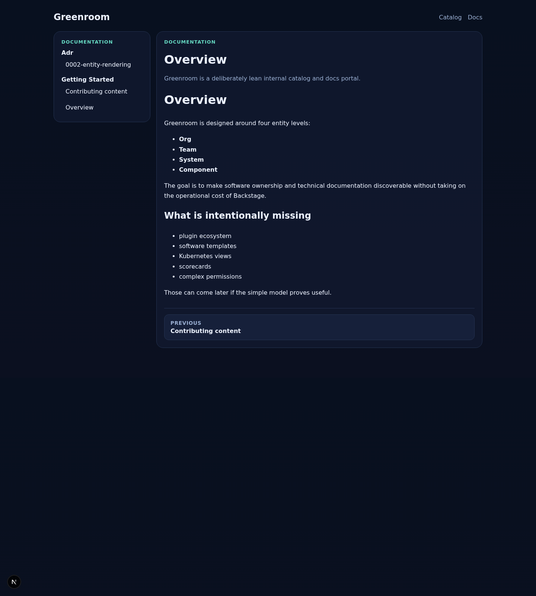

# Greenroom

Lean Backstage-style catalog and docs app for small teams that want ownership, system context, and practical documentation without the weight of a full platform.

## ✨ What it is

Greenroom keeps the model intentionally small:

- **Core model:** Org → Team → System → Component
- **Docs:** Markdown-first TechDocs-lite pages
- **Diagrams:** Mermaid in Markdown fences
- **Stack:** Next.js App Router + TypeScript + file-based content

The goal is simple: prove that teams can find the right owner, understand system context, and read useful docs before adding more platform machinery.

## 📸 UI snapshots

<p>
  
</p>

<p>
  
</p>

<p>
  
</p>

## 🧭 Current shape

- Catalog home with quick counts and entry points into content
- Entity pages for orgs, teams, systems, and components
- Markdown docs rendered inside the app
- Content stored in-repo for low-friction editing

## 🛠️ Local development

```bash
npm install
npm run dev
```

Open [http://localhost:3000](http://localhost:3000).
If port 3000 is already in use, Next.js will automatically pick the next available port.

## 📁 Content layout

```text
content/
  catalog/
    orgs/
    teams/
    systems/
    components/
  docs/
    getting-started/
  templates/
```

## 🚀 Useful scripts

```bash
npm run dev
npm run build
npm run typecheck
npm run test
```

## Graph Relations API

Greenroom exposes the existing Backstage catalog relations without adding a custom relation DSL.

`GET /api/catalog/entities/relations/:kind/:namespace/:name`

Response shape:

- `entity`: canonical entity reference metadata for the requested node
- `neighbors.owner`: owner group derived from `spec.owner`
- `neighbors.domain`, `neighbors.parentDomain`, `neighbors.system`, `neighbors.parentComponent`: direct `partOf` links derived from Backstage catalog fields
- `neighbors.providesApis`, `neighbors.consumesApis`, `neighbors.dependsOn`: direct neighbor links from catalog refs
- `neighbors.dependents`, `neighbors.systemsInDomain`, `neighbors.subdomains`, `neighbors.componentsInSystem`, `neighbors.subcomponents`, `neighbors.apisInSystem`, `neighbors.resourcesInSystem`, `neighbors.providingComponents`, `neighbors.consumingComponents`: reverse neighbor collections derived from the same catalog relations
- `brokenReferences`: unresolved catalog refs for the requested entity

Unknown entities return `404` with:

```json
{ "error": "Catalog entity not found", "slug": "component/default/missing" }
```

## Catalog Graph Navigation

Use `/catalog` to browse domains, systems, components, APIs, resources, and locations. Each entity card links to `/catalog/:kind/:namespace/:name`, where the detail page exposes:

- `Catalog path` breadcrumbs for domain → system → component traversal when those relations exist
- `Neighbors` cards grouped into toggleable relation filters for `Ownership`, `Part Of`, `Depends On`, `Provides / Consumes API`, and `System / Domain`
- kind-specific panels such as `Systems in domain`, `Components`, `APIs`, `Resources`, `Providing components`, and `Consuming components`
- `Broken references` warnings when catalog refs cannot be resolved from the loaded entities

The supported graph links come from standard Backstage fields:

- ownership: `spec.owner`
- containment: `spec.domain`, `spec.system`, `spec.subdomainOf`, `spec.subcomponentOf`
- API edges: `spec.providesApis`, `spec.consumesApis`
- dependency edges: `spec.dependsOn`, `spec.dependencyOf`

No additional runtime flags are required. The default in-repo catalog content is enough for the API and navigation UI to work locally.

## 🗺️ Near-term roadmap

See `docs/roadmap/feature-dev-stories.md` and the Antfarm backlog entries for planned work.
