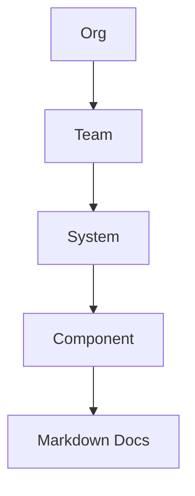

# Developer Portal

Greenroom starts as a narrow internal portal, not a platform kitchen sink.

## Scope rules

1. Catalog entities live in Markdown frontmatter.
2. Docs are first-class pages, not generated API references.
3. Mermaid should work out of the box for architecture diagrams.
